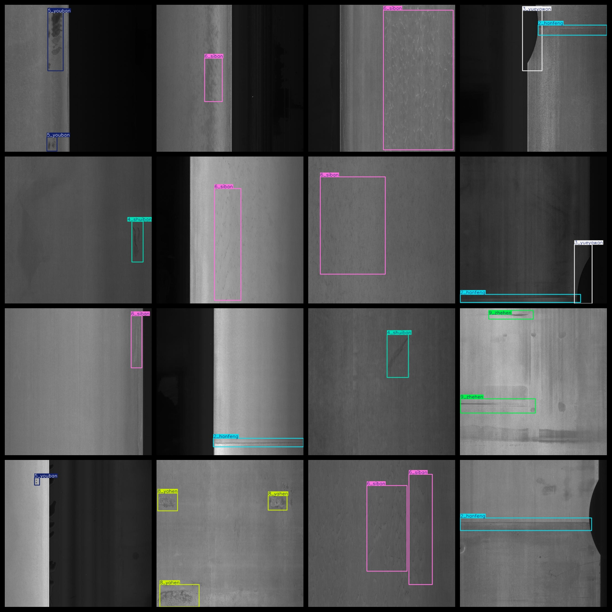

# Steels Defect Dataset 2281 imagesVOC+YOLO format

Steel defect dataset 2281 sheets in VOC + YOLO format

Dataset Format: VOC format + YOLO format

The compressed file contains: three folders, each storing images, xml files, and text files.

Total jpg images in JPEGImages folder: 2281

The total number of XML files in the Annotations folder: 2281.

The total number of txt files in the labels folder is 2281.

Number of tag types: 12

Tag names: ["1_chongkong","2_hanfeng","3_yueyawan","4_shuiban","5_youban","6_siban","7_yiwu","8_yahen","9_zhehen","10_yaozhe","10_yaozhed","d"]

The number of boxes for each label (Note that the order of labels in the Yolo format does not correspond to this, but is based on the classes.txt file in the labels folder):

1_chongkong frame count = 324

2_hanfeng frame count = 506

3_yueyawan frame count = 263

4_shuiban frame count = 352

5_youban frame count = 569

6_siban frame count = 885

7_yiwu frame count = 344

8_yahen frame count = 83

9_zhehen frame count = 74

10_yaozhe frame count = 11

10_yaozhed frame count = 131

d frame count = 1

Total boxes: 3543

Picture clarity (Resolution: Pixels): Clear

Is the image enhanced: No

Shape of the label: Rectangular box, used for object detection and recognition.

Important Note: None

Special Notice: This dataset does not guarantee the accuracy or precision of the trained models or weight files. The dataset only provides accurate and reasonable annotations.

Annotation and image details are as follows:

## Images

---

Here is a pay link on Stripe (https://buy.stripe.com/3cs8yP7sY87d0vu9AB). Please contact me lonlonago@foxmail.com after funding $89, and I will send you a complete data files, thank you!

